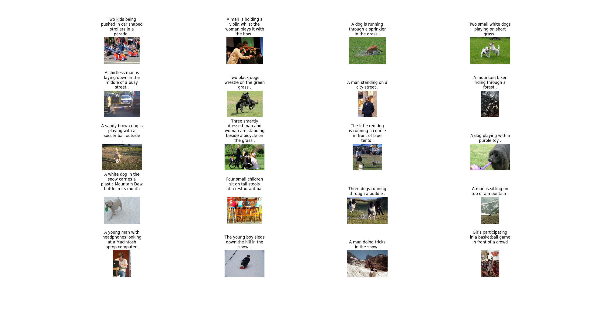

# Aerial Diffusion Reimplementation
 Repository to store the code for the Aerial Diffusion Reimplementation. Final project of the Computer Vision class at Sapienza Università di Roma for the Artificial Intelligence and Robotics course accademic year 2023/2024. Aim of the project is to re-implement the 'Aerial Diffusion: Text Guided Ground-to-Aerial View Translation from a Single Image using Diffusion Model' paper found at the link: https://arxiv.org/pdf/2303.11444.

## The Dataset
 For the dataset we originally thought about downloading images from the web and automatically annotate them, however image captioning is a task in itself that we decided was not relevant to the re-implementation thus we downloaded the Flickr 8K dataset from Kaggle (https://www.kaggle.com/datasets/adityajn105/flickr8k?resource=download). The chosen dataset contains 8000 images and a captions.txt file that contains 5 human-generated captions per image. An extract from the images and captions is below: 

## Files
 The util.py file contains utility code like the matching function for images and captions.